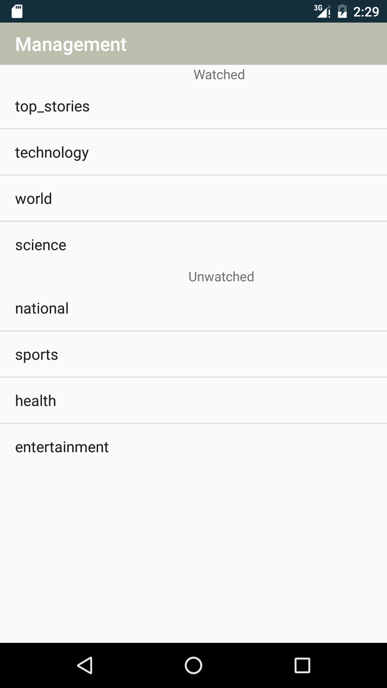
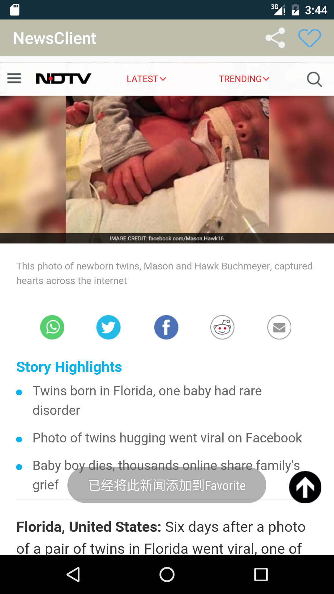
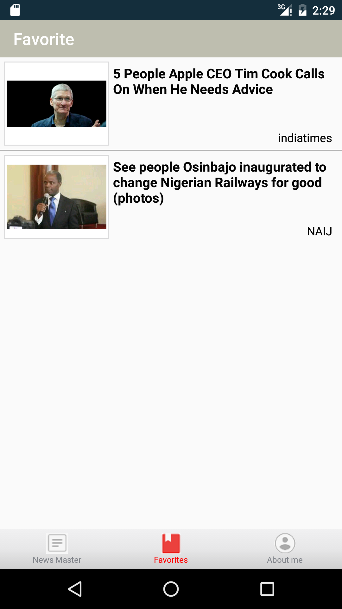

# Android-News-Client
本app是java课程大作业。基于一个新闻服务器制作一个android新闻客户端应用。

进入后如下图所示，可以显示多个频道，每个频道下有想相应的新闻列表：

用户可以通过上方的tab进行选择：

可以通过右上方的按钮选择订阅哪些频道：

点击某个新闻，可以进入查看新闻详情，并且可以进行分享或者收藏（通过右上角的按钮）：

用户可以查看自己已经收藏了哪些内容：

当然，本app支持上拉和下拉刷新操作，个人觉得基本实现了新闻客户端的基本功能。
